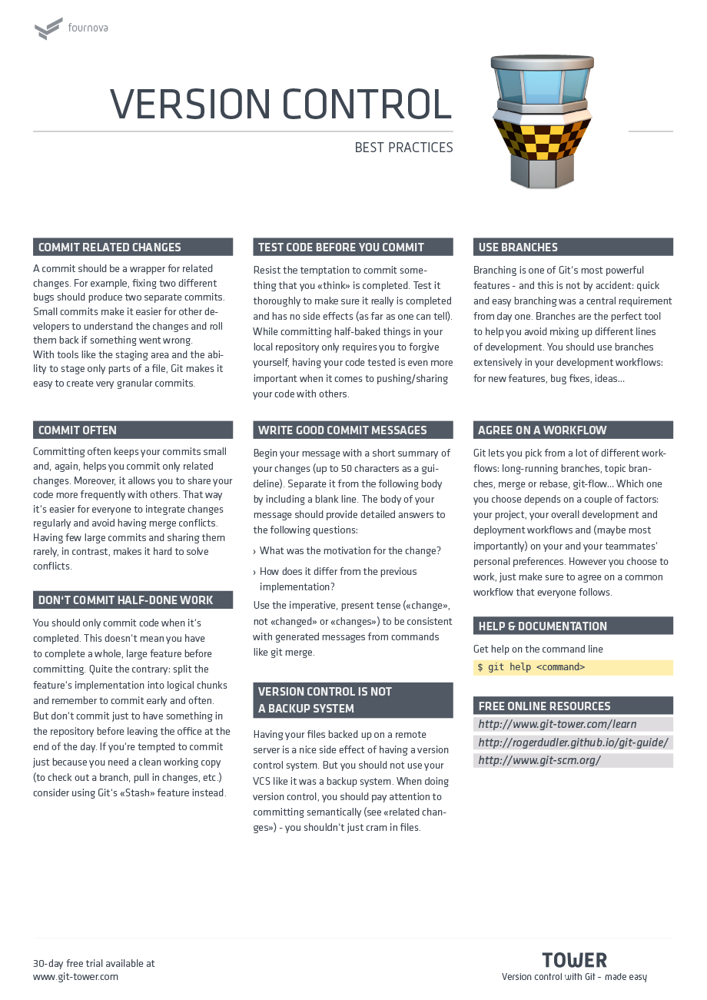

# useful-resources

## Table of Contents

Topic | Internal Link
--- | ---
A Visual Git Reference | [**Internal Link**](#a-visual-git-reference)
Git Cheat Sheet (1) | [**Internal Link**](#git-cheat-sheet-1)
Git Cheat Sheet (2) | [**Internal Link**](#git-cheat-sheet-2)

This is a collection of URLs that link to articles and various other helpful reference material

### A Visual Git Reference

- [**A Visual Git Reference**](https://marklodato.github.io/visual-git-guide/index-en.html) - https://marklodato.github.io/visual-git-guide/index-en.html

### Git Cheat Sheet 1

- Git Cheat Sheet (from [Tower]) (1) - https://www.git-tower.com/blog/git-cheat-sheet/

### Git Cheat Sheet 2

- Git Cheat Sheet (from [Tower]) (2) - https://www.git-tower.com/blog/git-cheat-sheet/

- [Instructions for installing a Lisk Node from source code] (http://wiki.lisk.prolina.org/Install-a-Lisk-node-on-Ubuntu)
